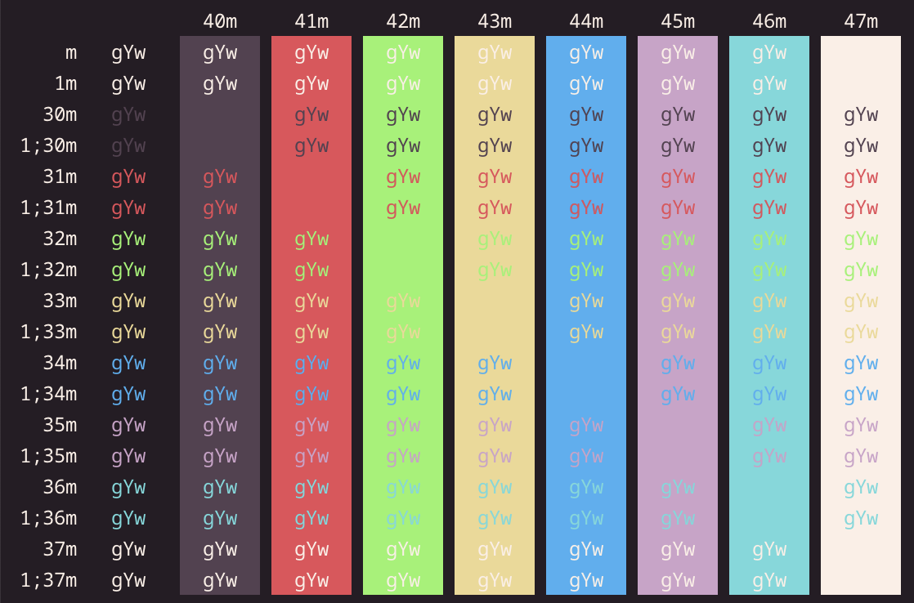
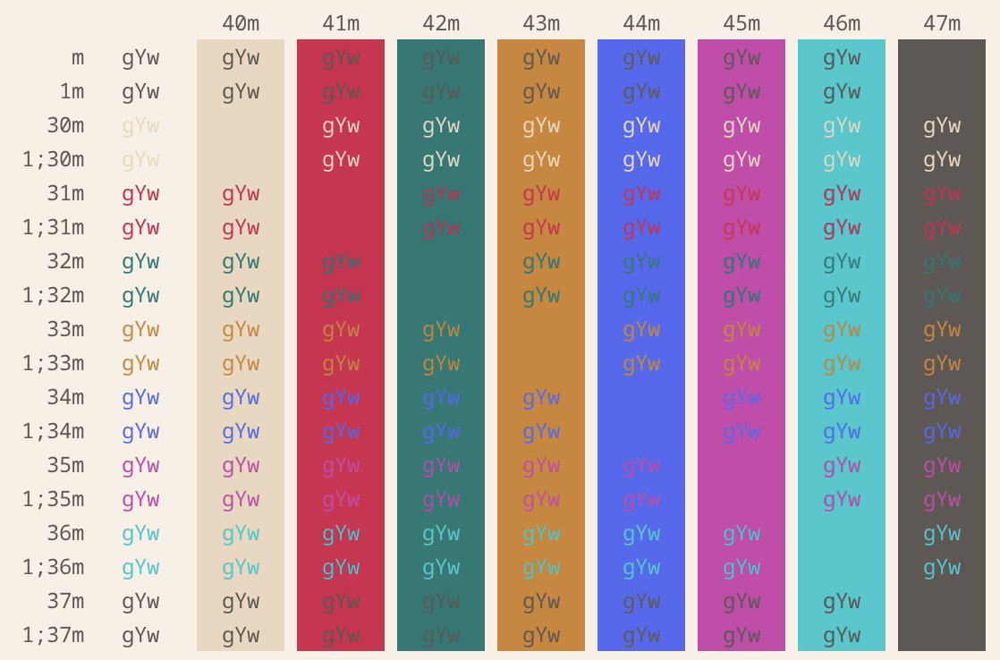
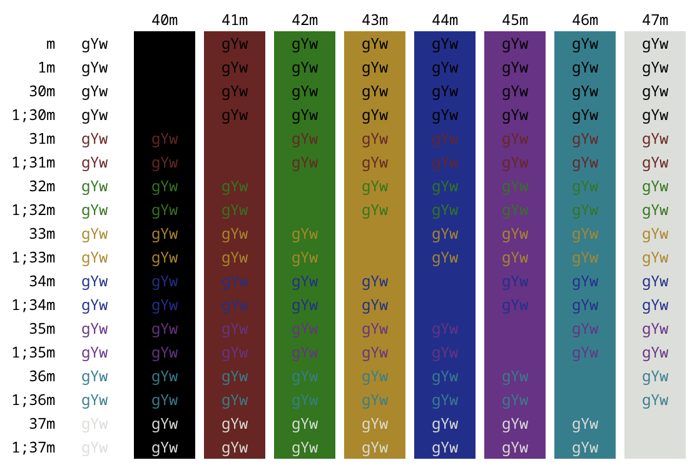

# iterm-themes

A collection of themes I've adapted to iTerm2.

## Acknowledgements

Both `kaolin-shiva` and `kaolin-valley-light` were adapted from
[emacs-kaolin-themes](https://github.com/ogdenwebb/emacs-kaolin-themes).

`modus-operandi` was adapted from
[modus-themes](https://protesilaos.com/emacs/modus-themes) using the
[color palette](https://protesilaos.com/emacs/modus-themes-colors)
released under the Creative Commons.

## Screenshots

### Kaolin Shiva

### Kaolin Valley Light

### Modus Operandi

